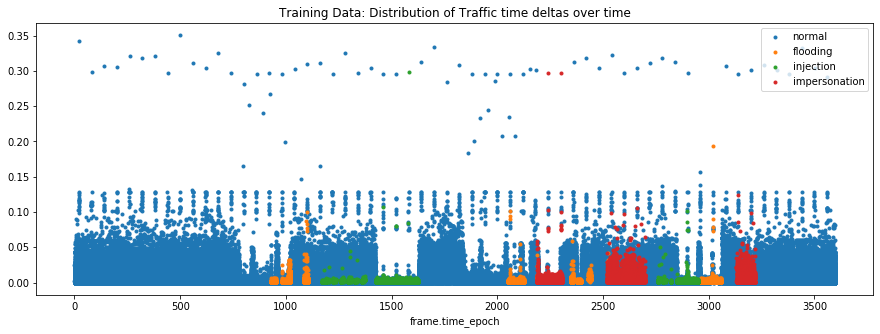
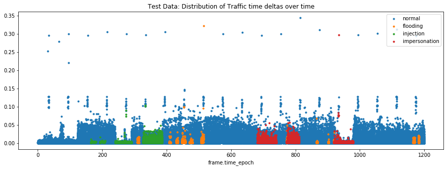

# Overview

This project is about detecting cyber attacks over a wifi network and how I developed a classifier with (relatively) an overall recall score of 83%. In this dataset, wifi activity is classified as either normal, flooding, injection or impersonation.

## Data

The data from this project is sourced from the AWID project (http://icsdweb.aegean.gr/awid/index.html). If you would like to use this data, please go to their website and ask for permission. The data is broken up into 4 different data sets, A larger data set (F) and a reduced version (R). For each dataset size, there is one that generalizes wifi activity into those mentioned earlier (CLS) and one that has more differentiation for each type of cyber attack (ATK). I will be focusing on the reduced dataset with more generalized classes for this project.

The following plot shows the distribution of the time delta of traffic over the hour that this data is recorded. Time is measured in seconds, hence why the x-axis is from 0 to 3600. It's a useful image because it gives a good sense of the distribution of the different targets over time

The test set ecompasses only 20 minutes of traffic data.

The data 

## Data pre-processing

For the preprocessing phase I have done the following

* Replaced missing values in categorcial features with the label 'missing'
* Created an aggregated count and rate of change of count feature on identity labels over 1 second intervals.
* Created a rare label for labels that appear less than 0.01% of the time.
* Replaced missing values in numeric features with -999
* Created numbered labels for all categorical labels.
* Feature selection includes removing constant features, quasi-constant features (features where 99% of the values are the same), and correlated features where the correlation is 80% or more.

Since the data set is massive and cyber attacks are so rare relative to normal activity, I decided to use downsampling until normal traffic was equal to the average count of the other types of cyber attacks. The downsampling took place after my features were created so that the aggregated counts would not be effected. 

## Model Selection

So far I have tried using xgboost and artificial neural networks from tensorflow 2.0 to tackle this problem. My best results have come from artificial neural networks using very few epochs to reduce overfitting on the training data.

## Cross-validation

I have not yet discovered any type of cross-validation that I have found to be useful for this data set. The cyber attacks have taken place in clusters over the span of the training data and there are only a few cluster of attacks for each type of cyber attack. A time series cross-validation feels like the best approach for this type of problem since the focus is on predicting cyber attacks in the future. However since many of the cross-validation sets do not contain some cyber attacks, then the results of the cross-validation are spoiled due to poor quality training data. On the other hand, picking rows at random for my cross-validation sets means that each set contains points from each cluster of cyber attacks and results in very high performance on the training sets but very poor performance on the test set. Therefore, I am using the provided train and test set until I can find a better solution. I still believe that the time-series cross-validation makes the most sense and that the problems it has will disappear when I switch to working on the larger dataset, which should contain more clusters of cyber attacks.

## Results

My best performing model is the artificial neural network using tensorflow 2.0. Using this model I achieved an accuracy of only 75%, but I achieved a recall of 83%. The following table shows all of the results.

|               | precision | recall | f1-score | support |
|---------------|-----------|--------|----------|---------|
| flooding      | 0.84      | 0.61   | 0.70     | 8097    |
| impersonation | 0.13      | 0.97   | 0.22     | 20079   |
| injection     | 0.84      | 0.99   | 0.91     | 16682   |
| normal        | 0.99      | 0.74   | 0.85     | 530784  |
|               |           |        |          |         |
| accuracy      |           |        | 0.75     | 575642  |
| macro avg     | 0.70      | 0.83   | 0.67     | 575642  |
| weighted avg  | 0.96      | 0.75   | 0.82     | 575642  |

The noteworthy performance is on injection and impersonation where I scored a 99% and 97% in recall. These results might seem poor, but keep in mind that the cost of asking a user to verify their information again is much lower than the cost of having your network accessed by an intruder. 
